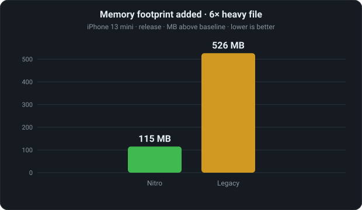

<!--
Meta — Audience: potential Nitro Modules users (RN / native-module engineers) and/or Rive users.
The piece doubles as a Nitro case study: assume familiarity with RN, TurboModules, JSI, Hermes
(don't explain them); do explain Rive (primary audience may not know it). Keep the Nitro/JSI/memory
internals; keep the ViewModel coverage light (one initial-values beat, not a full API tour).
-->

# Rewriting Rive React Native with Nitro Modules

The original Rive React Native runtime was built on TurboModules, which limited what the SDK could express. Rive's object model is full of things you'd want to hold and pass around in JS — files, view models, properties — but TurboModules model *modules*, not *objects*, so it all got flattened into one view. We rebuilt the SDK on Nitro modules, and not just because Nitro is known to be fast. Its real value here is letting us express a natural API for Rive's domain — and that API turns out to drive performance gains of its own.

## What is rive?

Rive is a tool for building interactive graphics — often described as a modern successor to Flash. Designers, animators, and developers work in one place: you design and animate in Rive's editor, add interactivity with state machines, and what you build is what ships — the same .riv file runs through a native runtime on web, React Native, Flutter, iOS, Android, Unity, and Unreal. Unlike playback-only formats, a Rive file reacts to input and to your app's data at runtime — and that data lives in an object model of files, artboards, view models, and typed properties.

## Challenges with TurboModules

TurboModules are great at what they're for: calling native functions from JS. But Rive isn't a bag of functions — it's an object graph

**TurboModules are singletons, not objects.** A TurboModule is one shared instance with a flat list of methods. It doesn't directly support objects — native resources with their own lifetime and instance methods — that you can hold and pass to JS. So RiveFile can't be a thing you hold; every call has to re-identify which file, view model, and property by string and id.

**Native resources only live inside views.** The view is RN's one abstraction with real identity and lifecycle, so the legacy SDK stuffs all native state into it and drives it with string-based RPC:

```typescript
// rive-react-native, src/Rive.tsx
UIManager.dispatchViewManagerCommand(
  findNodeHandle(riveRef.current),
  ViewManagerMethod.setNumberState,
  ['State Machine 1', 'speed', 1.5]
);
```

A resource that *isn't* a view — a `RiveFile` shared across screens - means hand-rolling an id-to-object map with no type safety and no lifecycle. And since Hermes has no `FinalizationRegistry`, there's no GC hook to free it when its JS handle goes away.

Swift support: it works but requires workarounds and Objective-C boilerplate. Rive's iOS runtime is Swift-first, so this is the language you actually want to write against. But for TurboModules every Swift class has to be re-exported to React Native through Objective-C: RiveReactNativeViewManager.swift needs a companion .m full of RCT_EXTERN_METHOD macros, @objc annotations scattered through the Swift, and a bridging header to wire it together. It's boilerplate you maintain by hand, and it drags Objective-C back into a codebase that wraps an otherwise pure-Swift code.

## Nitro Modules

Nitro Modules bills itself as "a framework to build mindblowingly fast native modules with type-safe, statically compiled JS bindings." The core idea is simple: with Nitro, a JavaScript object can be implemented in C++, Swift, or Kotlin instead of JS. Those are HybridObjects — native objects that  behave like ordinary JS objects, holding their own state and exposing methods, which you can create, hold references to, and pass around.

How it works, briefly: you describe your API as a TypeScript interface, and Nitrogen - Nitro's code generator tool - turns that spec into type-safe native bindings, a Swift protocol and a Kotlin interface. The TypeScript spec is the single source of truth; if your native implementation doesn't match the declared types, it won't compile.

Under the hood, Nitro sits directly on JSI. It uses jsi::NativeState rather than HostObject (lighter, and with proper prototypes so the JS garbage collector can reclaim objects), and on iOS it reaches Swift through Swift↔C++ interop - no Objective-C in the path at all. It's also just fast: Nitro's published benchmark runs a method 100,000 times in ~7ms, versus ~116ms for TurboModules.


## Rive react native use of Nitro

With Nitro, RiveFile becomes a HybridObject — a real native object you create, hold, and pass around, instead of an opaque id hidden behind module functions.

RiveFileFactory exposes fromResource (a bundled .riv), fromURL (a remote file), fromFileURL (a path on disk), and fromBytes (a raw ArrayBuffer) — each returning a Promise<RiveFile>:

```tsx
  const file = await RiveFileFactory.fromBytes(bytes);
  // or fromURL(...), fromResource(...), fromFileURL(...)
```


The view then simply receives a file

```tsx
  <RiveView file={file} />
```

The file is no longer owned/created inside the view, it's handed to it. Which unlocks patterns the legacy SDK couldn't:

  - Preload a file ahead of time, before any view mounts, then render instantly.
  - Share one loaded file across multiple RiveViews — parse once, render many times.

Memory: deterministic, with GC fallback. Standalone objects raise the question the old view lifecycle answered for free: who frees the file? Nitro gives you both halves.

Our hooks dispose eagerly. useRiveFile loads the file in an effect and calls dispose() on cleanup, so the native file is released the moment the component unmounts or its source changes — tied to React's lifecycle, not the GC.

And if you skip the hooks and create a RiveFile by hand, you're still safe: a Nitro HybridObject is backed by jsi::NativeState, whose C++ destructor runs when the JS handle is garbage-collected. So a file is freed eagerly if you dispose it, and at the latest when Hermes collects it.

### Setting values before the first frame

Data binding connects your app's data to a **view model instance**, and one everyday task exposes the difference sharply: configuring an animation *before* it's shown — a score, a player name, a theme color — so the first frame is already correct.

In legacy `rive-react-native` you can't do this cleanly. Values can only be set once the view has loaded and its ref becomes available, so they land *after* the first frame has rendered in the file's default state. Avoiding the visible flash needs workarounds — keeping the view hidden until it's initialized, then revealing it — a long-standing limitation ([issue #115](https://github.com/rive-app/rive-react-native/issues/115)).

With Nitro the instance is a standalone object you get from the file — you create it, set its values, and *then* hand it to the view, already configured:

```tsx
const { instance } = useViewModelInstance(file, {
  onInit: (vmi) => {
    vmi.numberProperty('score').set(1000);
    vmi.stringProperty('name').set('Player One');
  },
});

return <RiveView file={file} dataBind={instance} />;
```

That `onInit` is almost exactly the declarative initialization issue #115 asked for — and it falls straight out of view-model instances being real objects, not something the view owns.

## Results: a better API, measured

We ran both runtimes through the same scenarios in one app, toggling between them so every test goes through identical app code. The wins aren't micro-optimizations — they fall out of the architecture. Numbers below are from an iPhone 13 mini (iOS 26.5, **release** build), Nitro 0.4.10 vs legacy 9.8.3.

| Scenario | Nitro | Legacy | |
|---|---|---|---|
| Show graphics on 24 views (2.9 MB file) | **35 ms** | 2829 ms | ~82× |
| Memory footprint · 6× heavy file | **115 MB** | 526 MB | ~4.6× |
| Memory freed on unmount | **252 ms** | 263 ms | — |
| Data-bound property write | **5.8 µs** | 19.7 µs | ~3.4× |
| File load / dispose | **5.4 / 0.9 ms** | 17.2 ms\* | ~3.2× |

<sub>\*Legacy has no file API; mount→first-frame is the closest proxy.</sub>

### Showing graphics across many views

Nitro parses a file **once** and shares a single `RiveFile` across views, so each view just instantiates an artboard; legacy re-parses the whole file inside every view. So 24 views of a 2.9 MB file all appear in ~35 ms on Nitro — a single frame — while legacy blocks for ~2.8 seconds before the grid shows up. An ~82× gap that widens as files grow or views multiply.

### Lower memory

Legacy loads an independent copy of the file per view; Nitro keeps one shared copy. With six instances of a heavy file mounted, that's the difference between a **115 MB** footprint and **526 MB** — a ~4.6× gap, and on a memory-tight device the kind of thing that decides whether you stay alive or get OOM-killed:



Both runtimes release promptly once you navigate away — footprint returns to baseline in ~250 ms either way, with no leak. The difference isn't *when* memory comes back, it's how much you hold while the views are alive.

### Faster property writes

A data-binding write is a single property set: a synchronous JSI call on Nitro (~5.8 µs) versus an async bridge round-trip on legacy (~19.7 µs) — about 3.4× cheaper per write, ~173k vs ~51k writes/sec. For an animation driven by frequent updates — a scrubber, a gesture, a live counter — that headroom keeps writes off the frame budget.

### File loading

Nitro exposes a real, programmatic file API, so load and dispose are explicit and fast (5.4 ms / 0.9 ms). Legacy has no file API at all; the closest proxy is mount → first frame (~17 ms).

The throughline: showing many views at once, holding far less memory while they're alive, and cheaper property writes all fall out of the same thing — the file and its properties are real objects you create once and share, not state re-parsed and trapped inside every view.

### Bonus: Testing

The SDK is tested with [`react-native-harness`](https://www.react-native-harness.dev/) — a tool that runs tests on a real simulator or device against the actual native code, rather than mocking it. It grew out of Nitro Modules' on-device test runner, later spun into a standalone library. That lets `@rive-app/react-native` reach significant code coverage across the real Swift implementation, not just the JS layer: 17 harness suites cover view models, property types, asset loading, triggers, navigation lifecycle, and disposal, with native code coverage wired in (`test:harness:ios:coverage`).
